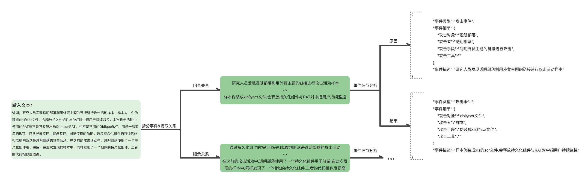

# LLM_NER

## introduction

本项目使用提示工程，经过多轮询问得到输入文本的事件关系



## usage

### 环境配置

首先需要下载本仓库：

```shell
git clone https://github.com/Andrew82106/LLM_NER.git
cd LLM_NER
```

然后使用 pip 安装依赖：

```
pip install -r requirements.txt
```

其中 `transformers` 库版本推荐为 `4.30.2`，`torch` 推荐使用 2.0 及以上的版本，以获得最佳的推理性能。

本项目默认使用ChatGLM2-6B模型，因此此时下ChatGLM2-6B模型权重文件

从 Hugging Face Hub 下载模型需要先[安装Git LFS](https://docs.github.com/zh/repositories/working-with-files/managing-large-files/installing-git-large-file-storage)，然后运行

```Shell
git clone https://huggingface.co/THUDM/chatglm2-6b
```

如果你从 Hugging Face Hub 上下载 checkpoint 的速度较慢，可以只下载模型实现

```Shell
GIT_LFS_SKIP_SMUDGE=1 git clone https://huggingface.co/THUDM/chatglm2-6b
```

将下载好的模型实现（chatglm2-6b文件夹）中的内容放到本项目的``THUDM/chatglm2-6b``文件夹下

然后从[这里](https://cloud.tsinghua.edu.cn/d/674208019e314311ab5c/)手动下载模型参数文件，并将下载的文件替换到本项目的``THUDM/chatglm2-6b``文件夹下

### 单文本处理

将文本放到项目``ChatGLM2-6B/workspace/input/single.txt``中，然后运行：

`` python main.py --task single --savepath ./single_ana_res.json``

即可在文件``single_ana_res.json``中找到处理结果

### 文本批量处理

将文本放到项目``ChatGLM2-6B/workspace/input/batches.txt``中，以换行分割样本，然后运行：

`` python main.py --task batches --savepath ./batches_ana_res.json``

即可在文件``batches_ana_res.json``中找到处理结果

## evaluate

## ChatGLM2-6B

本项目基于ChatGLM2-6B[repo link](https://github.com/THUDM/ChatGLM2-6B)进行开发，主要代码在``workspace``文件下
